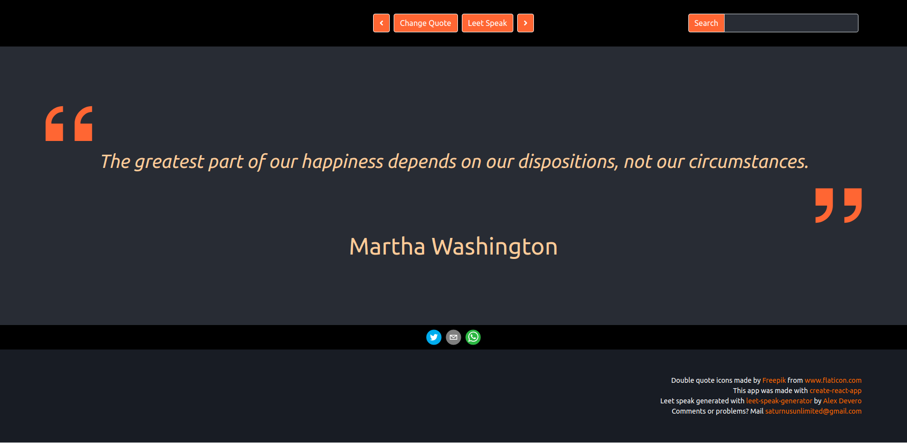

## General

The code in this repository implements a simple web app that displays a random
quote. The project is part of an assignment for a job application, and it is
work in progress. This project was bootstrapped with [Create React App](https://github.com/facebook/create-react-app).

## Disclaimer

The content of this repository is provided "as is" without
warranty of any kind, either expressed or implied and the software therein
is to be used at your own risk. The use of the software in this repository
is done at your own discretion and risk and with agreement that you will be
solely responsible for any damage to your computer system or loss of data
that results from such activities. You are solely responsible for adequate
protection and backup of the data and equipment used in connection with any
of the software in or refered to by this repository, and we will not be
liable for any damages that you may suffer in connection with downloading,
installing, using, modifying or distributing such software. No advice or
information, whether oral or written, obtained by you from us or from this
repository shall create any warranty for the software. The above includes
all third-party software that is refered to in this repository.

## Screen shots

## Installation on Windows

The following procedure was tested on a clean Windos 10 installation on a virtual
machine. Basically you need NodeJS and yarn to install this project. To
intall those two you need a windows command line package manager. In this
guide we use package manager 'scoop'
([how to install the scoop package manager in windows-10](https://www.onmsft.com/how-to/how-to-install-the-scoop-package-manager-in-windows-10)).

    1. Download and unzip this repository from GitHub to your machine.

    2. Start up the Windows Power Shell.

    3. INSTALL SCOOP

        Skip this step if the scoop command is already available on the command
        line of your Windows Power Shell.

        > Set-ExecutionPolicy RemoteSigned -scope CurrentUser
        > iex (new-object net.webclient).downloadstring('https://get.scoop.sh')

    4. INSTALL NodeJS

        Skip this step if nodejs is already installed on your system.

        > scoop install nodejs

    5. INSTALL yarn

        Skip this step if yarn is already installed on your system.

        > scoop install yarn

    6. INSTALL dependencies of this package

        The yarn command below should be executed in the main folder
        of this repository. That is the folder where you can find
        the file you are reading now (README.md).

        > cd \your\local\main\folder\of\this\repository
        > yarn add react-scripts

    7. STARTUP

        This will start the server and open the quote app in your browser.

        > yarn start

## Notes

The content in the sections after this one are auto generated by the
create-react-app script, see [Create React App](https://github.com/facebook/create-react-app).

## Available Scripts

In the project directory, you can run:

### `yarn start`

Runs the app in the development mode. 
Open [http://localhost:3000](http://localhost:3000) to view it in the browser.

The page will reload if you make edits. 
You will also see any lint errors in the console.

### `yarn test`

Launches the test runner in the interactive watch mode. 
See the section about [running tests](https://facebook.github.io/create-react-app/docs/running-tests) for more information.

### `yarn build`

Builds the app for production to the `build` folder. 
It correctly bundles React in production mode and optimizes the build for the best performance.

The build is minified and the filenames include the hashes. 
Your app is ready to be deployed!

See the section about [deployment](https://facebook.github.io/create-react-app/docs/deployment) for more information.

### `yarn eject`

**Note: this is a one-way operation. Once you `eject`, you can’t go back!**

If you aren’t satisfied with the build tool and configuration choices, you can `eject` at any time. This command will remove the single build dependency from your project.

Instead, it will copy all the configuration files and the transitive dependencies (Webpack, Babel, ESLint, etc) right into your project so you have full control over them. All of the commands except `eject` will still work, but they will point to the copied scripts so you can tweak them. At this point you’re on your own.

You don’t have to ever use `eject`. The curated feature set is suitable for small and middle deployments, and you shouldn’t feel obligated to use this feature. However we understand that this tool wouldn’t be useful if you couldn’t customize it when you are ready for it.

## Learn More

You can learn more in the [Create React App documentation](https://facebook.github.io/create-react-app/docs/getting-started).

To learn React, check out the [React documentation](https://reactjs.org/).

### Code Splitting

This section has moved here: https://facebook.github.io/create-react-app/docs/code-splitting

### Analyzing the Bundle Size

This section has moved here: https://facebook.github.io/create-react-app/docs/analyzing-the-bundle-size

### Making a Progressive Web App

This section has moved here: https://facebook.github.io/create-react-app/docs/making-a-progressive-web-app

### Advanced Configuration

This section has moved here: https://facebook.github.io/create-react-app/docs/advanced-configuration

### Deployment

This section has moved here: https://facebook.github.io/create-react-app/docs/deployment

### `yarn build` fails to minify

This section has moved here: https://facebook.github.io/create-react-app/docs/troubleshooting#npm-run-build-fails-to-minify
